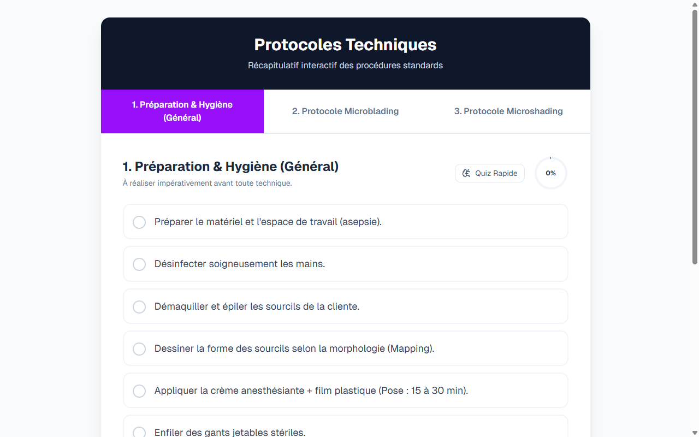

# Quiz / Test — Microblading + Microshading Slide 14

**Course:** MICROBLADING + MICROSHADING  
**Slide:** 14  
**Live URL:** https://testi.edtechiecorp.com  
**Stack:** Next.js · Tailwind CSS · TypeScript · GitHub Pages  

## What this slide does

A quiz or test module near the end of the combined microblading and microshading course that assesses learners' knowledge across the key topics covered throughout the module. Tests understanding of technique differences, contraindications, pigment selection, and protocol steps. Positioned at slide 14, this assessment helps both learners and instructors identify knowledge gaps before the learner completes the course.

## Screenshot

## Usage

This slide is embedded as an iframe inside Coassemble at the live URL above. DNS is managed via Cloudflare (`edtechiecorp.com`). To update the slide, push to the `main` branch — GitHub Actions will rebuild and redeploy automatically.
